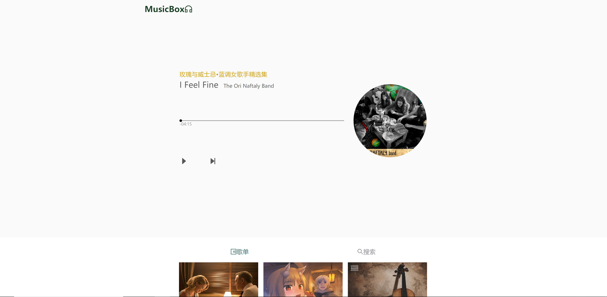

# MusicBox

 下载网易云音乐 Node.js API service https://github.com/Binaryify/NeteaseCloudMusicApi

```$ git clone git@github.com:Binaryify/NeteaseCloudMusicApi.git```

```$ npm install```

运行
```$ node app.js```


下载本项目

```git clone https://github.com/quixotiko/MusicBox.git```

运行

```npm install ```

```npm start```

### 效果


<div align="center"></div>

<div align="center"></div>

<div align="center"></div>

<div align="center"></div>

<div align="center"></div>


